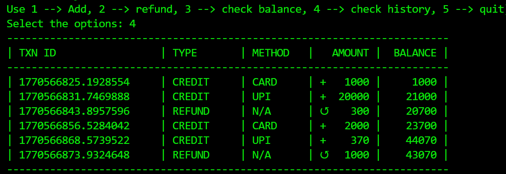

**Please use below command to run the code:**
python main.py 

**💳 Payment Processing System**

A modern, Object-Oriented Payment Processing System built with Python. This project demonstrates clean code principles, modular architecture, and the use of high-performance Python tooling.

**🚀 Features**

**Modern Environment Management:** Built using uv for lightning-fast dependency resolution and project isolation.

**OOPS Architecture:** Implements Object-Oriented Programming for scalable and maintainable transaction handling.

**Structural Pattern Matching:** Uses Python’s match keyword for elegant routing of different payment methods (UPI, Card, Refunds).

**Professional Formatting:** Advanced use of f-strings to generate clean, aligned transaction histories.

**Time-Stamped Logging:** Integrated time module for real-world transaction simulation.

**🛠️ Technical Stack**
Language: Python 3.10+

**Package Manager:** 
uv packager

**Key Modules:** time, re, dataclasses

**📥 Installation & Setup**
Ensure you have uv installed. If not, you can install it via:

1. Clone the repository
2. Sync the environment
3. Run the application

**📖 Key Concepts Covered**

1. Structural Pattern Matching
We use the match statement to handle various transaction types efficiently:

2. Modular Structure
The project is split into packages and modules to keep the logic separated:

**core:** Contains the base OOPS logic.

**utils:** Contains formatting and helper functions.

## Sample Output:

